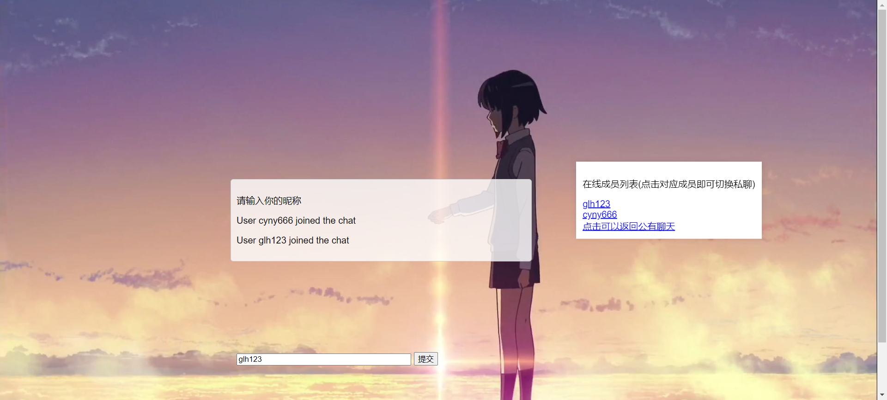

用GO实现动态聊天室

文件目录为下

.
├── README.md   -----项目的说明文件
├── background.jpg  -----用户端的背景图片
├── go.mod 		----go的模块定义文件
├── go.sum		-----go的模块检验文件
├── index.html	----用户端的前端界面
├── script.js		----用户端的JavaScript代码
├── server.go	 ----服务器端的代码

项目总体说明：

主要用了go语言实现服务器端，js语言实现了用户端，实现了交互，采用的协议为websocket协议

WebSocket 是一种标准协议，用于在客户端和服务端之间进行双向数据传输。但它跟 HTTP 没什么关系，它是基于 TCP 的一种独立实现。

以前客户端想知道服务端的处理进度，要不停地使用 Ajax 进行轮询，让浏览器隔个几秒就向服务器发一次请求，这对服务器压力较大。另外一种轮询就是采用 long poll 的方式，这就跟打电话差不多，没收到消息就一直不挂电话，也就是说，客户端发起连接后，如果没消息，就一直不返回 Response 给客户端，连接阶段一直是阻塞的。

而 WebSocket 解决了 HTTP 的这几个难题。当服务器完成协议升级后（ HTTP -> WebSocket ），服务端可以主动推送信息给客户端，解决了轮询造成的同步延迟问题。由于 WebSocket 只需要一次 HTTP 握手，服务端就能一直与客户端保持通信，直到关闭连接，这样就解决了服务器需要反复解析 HTTP 协议，减少了资源的开销。

具体的配置方案：

先克隆到本地

```shell
git clone https://github.com/cyny666/chatroom
```

然后安装项目所需依赖

````shell
go get ./...
````

然后可以运行客户端

```shell
go run server.go
```

然后可以在本地打开index.html即可

先输入昵称


然后即可进入聊天室



然后即可发信息与在聊天室内的所有人交流


然后可以在右边点击相关成员进行私聊

